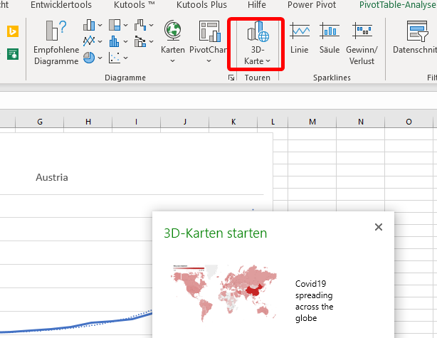
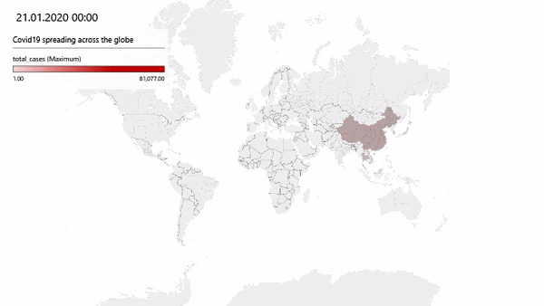

# Covid19 Spreadsheet
This spreadsheet reads the latest data from [https://covid.ourworldindata.org](https://covid.ourworldindata.org/). Just press the "Refresh All Button" to get the newest data. A Pivot-Table shows the temporal spread per country / world. The full_data source includes the whole world. 4 Maps show the latest data of total cases and deaths and newest cases and deaths around the globe.

There is an animated map of the spreading as well.

